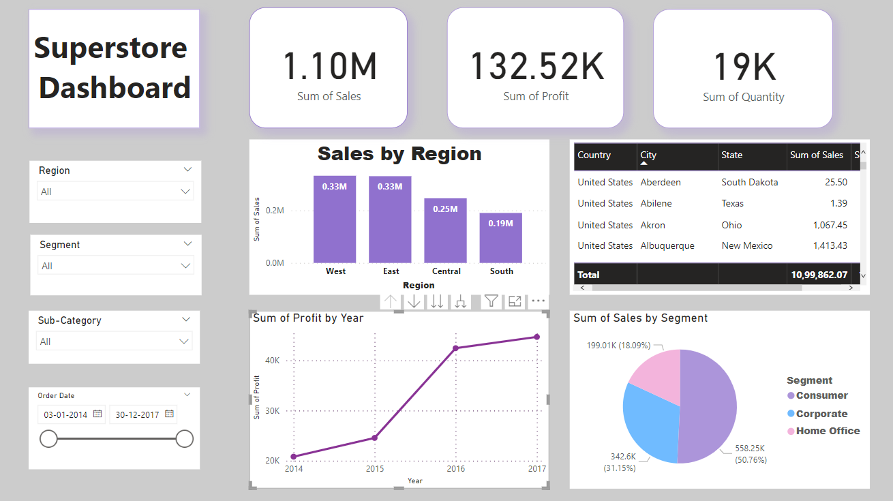

# Superstore-Sales-PowerBI-Dashboard     
Concepts learnt while creating this Dashboard:-          
✅ Understanding various visuals in Power BI    
✅ Using built in functions to perform calculations     
✅ Creating bar, pie charts, graphs to highlight details     
✅ Key insights with respect to Attributes like Regions, Category, Sub-category, Sales, Profit
✅Sales were maximum in west and east region generating revenue of 0.33Million while profit reaching around 22k by the 
year 2017. 
✅Corporate segment profits saw a sharp dip 20k to 5k from 2016 to 2017

